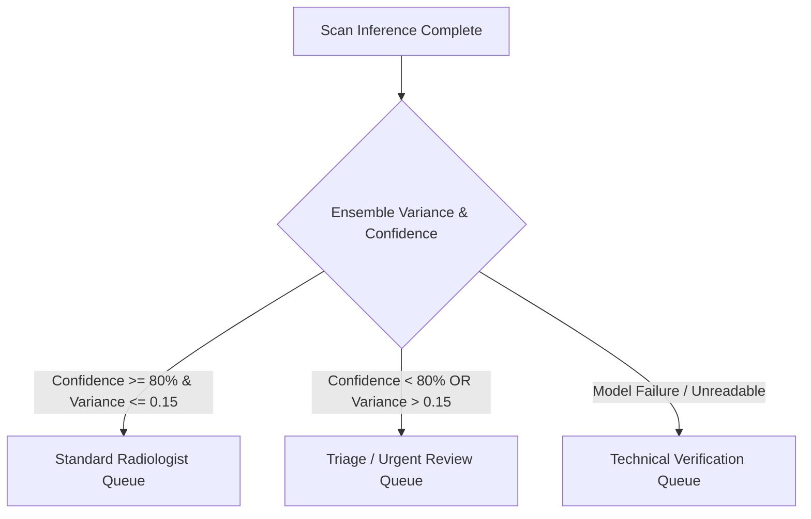

# Clinical Validation & Human-in-the-Loop (HITL) Protocol
## Neuron AI National Healthcare CDSS Network (India)

This protocol outlines the operational and architectural guidelines to guarantee final diagnostic control remains with certified clinical practitioners (Radiologists) when using the **Neuron AI CDSS** platform. It aligns with the **National Digital Health Mission (NDHM) / Ayushman Bharat Digital Mission (ABDM)** directives and the **Digital Personal Data Protection (DPDP) Act 2023** of India.

---

## 1. Clinical Ingestion & Triage Routing Rules

Every scan processed by the Neuron AI engine is assigned a clinical confidence rating and variance metric. Based on these inputs, the system routes the scan into one of three worklists:



### Triage Classifications
1. **Standard Review Queue**: Confidence score $\ge 80\%$ with ensemble consensus (variance $\le 0.15$). The radiologist reviews the AI suggestions as a secondary validator.
2. **Clinical Triage Queue (Urgent)**: Triggered if:
   - The primary diagnostic confidence falls below **80%**.
   - The ensemble variance exceeds **0.15** (Clinical Discrepancy).
   - The pathology is elevated (e.g., Ischemic Stroke, Pneumothorax, or Acute Hemorrhage).
   These scans are elevated to `priority = "high"` and placed at the top of the workstation dashboard with a mandatory "Specialist Over-read Required" banner.
3. **Technical Audit Queue**: Scans that fail pre-inference validation or raise ONNX runtime execution errors are routed here for technical imaging audits.

---

## 2. Human-in-the-Loop (HITL) Sign-Off Workflow

To ensure doctors maintain absolute diagnostic control, **no AI inference is ever written directly to a patient's permanent health record** without radiologist validation.

### Step-by-Step Sign-off Sequence:
1. **Interactive Review**: The radiologist opens the scan in the workstation. The UI displays the AI-predicted pathology, probability matrix, and the Grad-CAM bounding box overlay.
2. **Concurrence / Modification**:
   - **Concur (Approve)**: The radiologist approves the AI finding. The scan status updates from `completed`/`triage` to `validated`.
   - **Override (Edit)**: The radiologist rejects the AI finding and selects the correct pathology from a drop-down menu (e.g. changing "Pneumonia" to "Tuberculosis").
3. **Audit Log Generation**: Upon clicking "Validate & Sign Report", the system generates an audit record:
   ```json
   {
     "scan_id": "592a1dcb-20ce-4d85-942b-079232131646",
     "radiologist_id": "MCI-184920",
     "ai_prediction": "Ischemic Stroke",
     "ai_confidence": 0.88,
     "final_decision": "Ischemic Stroke",
     "override_occurred": false,
     "timestamp": "2026-06-18T04:02:00Z"
   }
   ```
4. **ABDM Consent Manager Integration**: Validated reports are signed with the radiologist's digital signature and linked to the patient's **ABHA (Ayushman Bharat Health Account)** address via secure ABDM consent gateways.

---

## 3. Override Auditing & Continuous Learning Loop

To facilitate model optimization and quality control, all overrides are processed through a secure feedback loop:
- **Discrepancy Reporting**: Monthly reports tracking the model's false-positive and false-negative rates against radiologist consensus are compiled.
- **Ensemble Fine-Tuning**: Confirmed override cases (where the model was incorrect) are anonymized under DPDP guidelines and queued for retraining on local GPU nodes.

---

## 4. Legal & Regulatory Compliance (India)

- **DPDP Act 2023**: All Patient Identifiable Information (PII) is fully stripped client-side (via `useMedicalParser` headers scrub) before transmitting data.
- **Medical Council of India (MCI) Guidelines**: The AI operates strictly as a **Class IIa / Class IIb Medical Device Decision Support Tool**. The final liability for any medical diagnosis remains with the signing physician.
